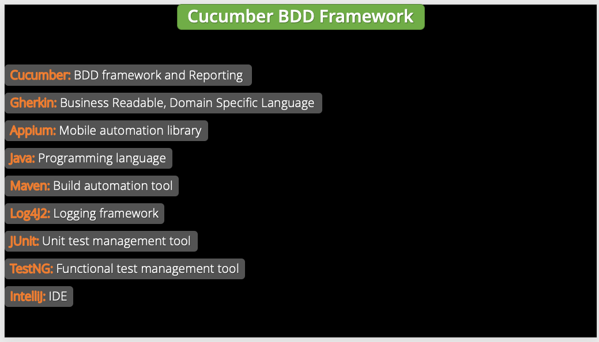
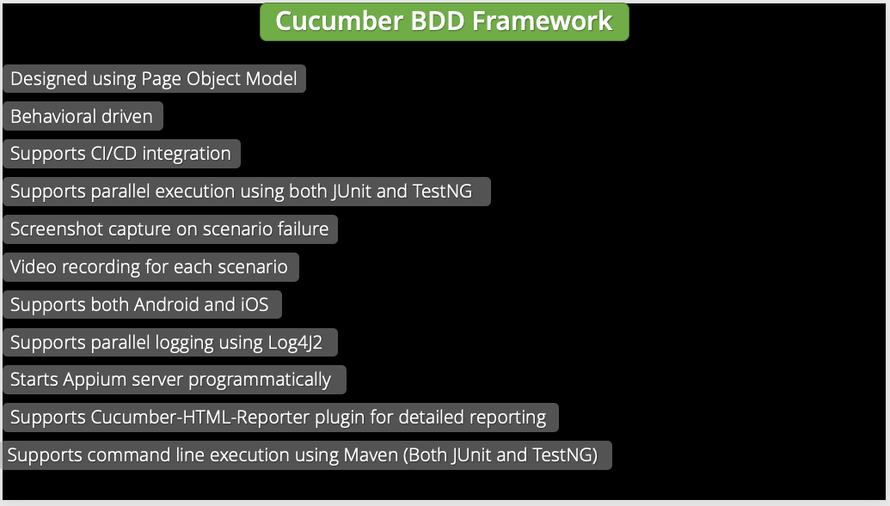
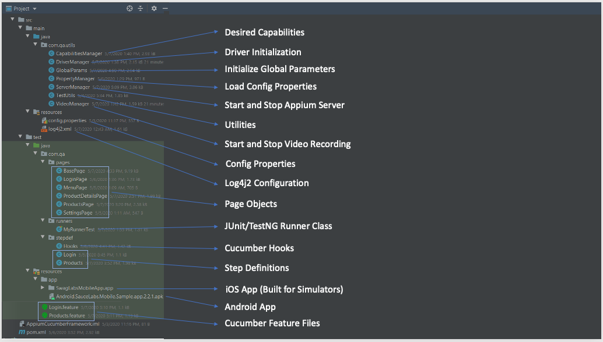
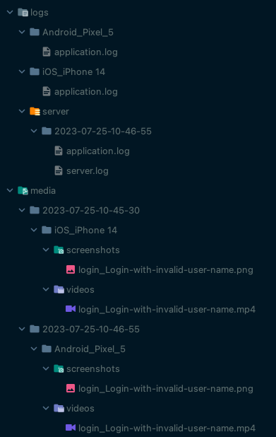

# Appium BDD Framework 

* This is a behavior driven test automation framework for mobile applications built with Appium Java and Cucumber.
* This repo contains the source code for the framework designed during the [Omparkash Chavan Udemy Course](https://www.udemy.com/course/the-complete-appium-course-for-ios-and-android).
* Refer to the [Appium TDD Framework](https://github.com/itkhanz/AppiumTDDFramework-OC) to get more understanding of the framework design and implementation details.

---

## Libraries and Tools

* Maven 3.9.2
* JDK 17.0.2
* Cucumber JUnit 7.13.0
* Appium Java client 8.5.1
* Appium server 2.0
    * drivers
        * uiautomator2@2.29.2
        * xcuitest@4.32.19
* Log4J2 2.20.0
* Demo Apps
    * [Sauce Labs Native Sample Application](https://github.com/saucelabs/sample-app-mobile)
* IntelliJ IDE

---

## Pre-requisites

* Install Maven
* Install Appium 2.0
* Install uiautomator2, xcuitest drivers
* Install Android Studio and setup Emulator
* Install XCode and setup Simulator (only for MAC)
* Configure Path variables as per your OS
* Verify the setup with appium-doctor
* Configure global properties in config.properties in src/main/resources
* Build the pom.xml to download the dependencies

--- 

## Framework 

---

## Notes

* Add feature files
* Add [Cucumber JUnit Runner](https://cucumber.io/docs/cucumber/api/?lang=java#junit)
* Run the Runner class in IntelliJ which will generate the code snippets for missing step definitions.
* Rename the step defs method arguments to reflect the parameters.
* Change the `dryrun` to false, and remove the `throw new io.cucumber.java.PendingException();` from stepdefs.
* Rerun the test to make sure that all the steps pass.
* Copy the apps to `src/test/resources/apps` and add the app properties in `config.properties`
* Add [log4j2 configurations](https://github.com/omprakashchavan01/log4j2_properties)
* Add the log related utils in `TestUtils`
* Add Cucumber hooks which will serve to start and stop the appium server, start and quit the appium driver session,
  launch app, take screenshot and start/stop video recording of tests.
* Create GlobalParams that enable use to collect the system properties sent from maven command line.
  * Both Android and iOS: platformName, udid, deviceName
  * iOS only: wdaLocalPort
  * Android only: systemPort, chromeDriverPort
* We will declare them as ThreadLocal, so they support parallel execution.
* create ServerManager to programmatically start the appium server.
* Create the PropertiesUtils to load the properties from config.properties
* Create DriverManager and DriverOptionsManager to initialize the platform specific driver.
* Initialise driver in Before hook and Quit in After hook (and set to null)
* Add Base Page and Page Objects
* Update step definitions with the method from page objects
* You can run the tests also from commandline:
  * If no system parameters are provided, then the tests will run by default on Android emulator-5554
  * `mvn clean test -D"platformName=Android" -D"udid=emulator-5554" -D"deviceName=Pixel_5" -D"systemPort=10002" -D"chromeDriverPort=11002"`
  * `mvn clean test -D"platformName=iOS" -D"udid=1E8FE39B-1118-4117-B02B-66A390AECB3F" -D"deviceName=iPhone 14" -D"wdaLocalPort=8101"`

* Embed screenshot in report on test failure.
* save screenshot to local disk.
* Move all the screenshot related to separate utility class
* create VideoUtils to record videos for test execution
* This is how the logs and media are stored:

* 

---