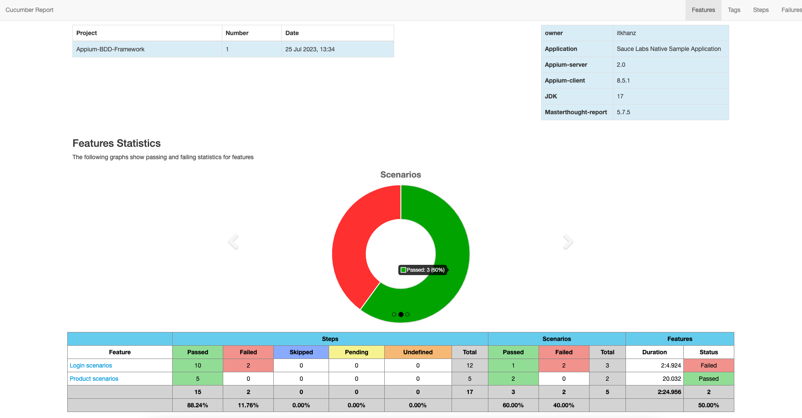
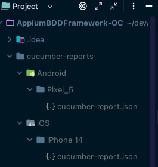
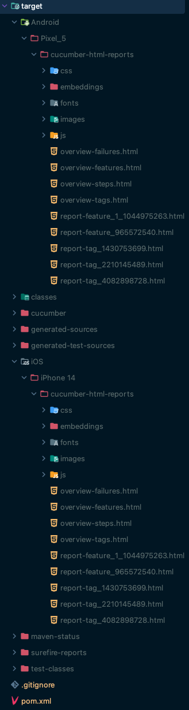
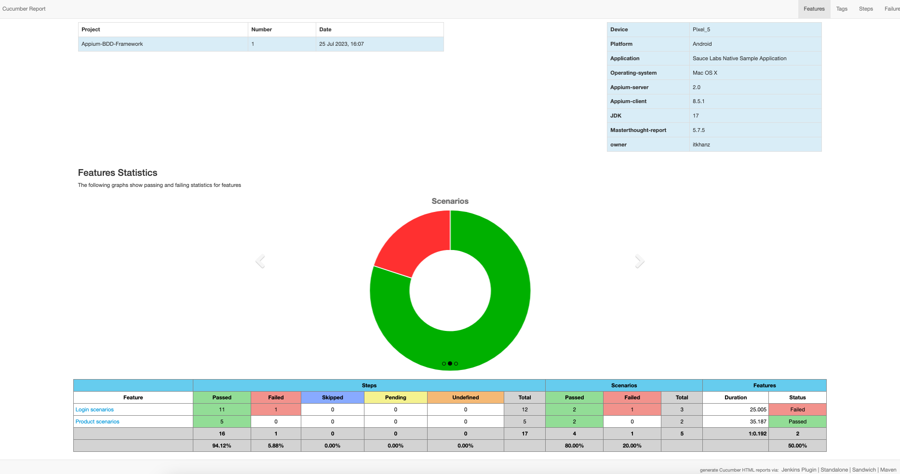
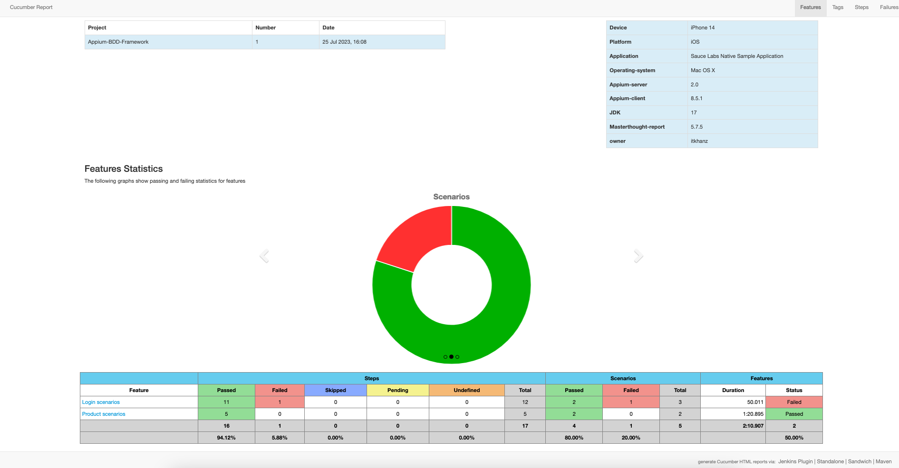

# Appium BDD Framework 

* This is a behavior driven test automation framework for mobile applications built with Appium Java and Cucumber.
* This repo contains the source code for the framework designed during the [Omparkash Chavan Udemy Course](https://www.udemy.com/course/the-complete-appium-course-for-ios-and-android).
* Refer to the [Appium TDD Framework](https://github.com/itkhanz/AppiumTDDFramework-OC) to get more understanding of the framework design and implementation details.
* The code for the original repo has been further refactored to incorporate clean coding practices.

---

## Libraries and Tools

* Maven 3.9.2
* JDK 17.0.2
* Cucumber JUnit 7.13.0
* Appium Java client 8.5.1
* Appium server 2.0
    * drivers
        * uiautomator2@2.29.2
        * xcuitest@4.32.19
* Log4J2 2.20.0
* Demo Apps
    * [Sauce Labs Native Sample Application](https://github.com/saucelabs/sample-app-mobile)
* IntelliJ IDE

---

## Pre-requisites

* Install Maven
* Install Appium 2.0
* Install uiautomator2, xcuitest drivers
* Install Android Studio and setup Emulator
* Install XCode and setup Simulator (only for MAC)
* Configure Path variables as per your OS
* Verify the setup with appium-doctor
* Configure global properties in config.properties in src/main/resources
* Configure project properties in project.properties in src/main/resources
* Build the pom.xml to download the dependencies

--- 

## Framework 


---

## Notes

* Add feature files
* Add [Cucumber JUnit Runner](https://cucumber.io/docs/cucumber/api/?lang=java#junit)
* Run the Runner class in IntelliJ which will generate the code snippets for missing step definitions.
* Rename the step defs method arguments to reflect the parameters.
* Change the `dryrun` to false, and remove the `throw new io.cucumber.java.PendingException();` from stepdefs.
* Rerun the test to make sure that all the steps pass.
* Copy the apps to `src/test/resources/apps` and add the app properties in `config.properties`
* Add [log4j2 configurations](https://github.com/omprakashchavan01/log4j2_properties)
* Add the log related utils in `TestUtils`
* Add Cucumber hooks which will serve to start and stop the appium server, start and quit the appium driver session,
  launch app, take screenshot and start/stop video recording of tests.
* Create GlobalParams that enable use to collect the system properties sent from maven command line.
  * Both Android and iOS: platformName, udid, deviceName
  * iOS only: wdaLocalPort
  * Android only: systemPort, chromeDriverPort
* We will declare them as ThreadLocal, so they support parallel execution.
* create ServerManager to programmatically start the appium server.
* Create the PropertiesUtils to load the properties from config.properties
* Create DriverManager and DriverOptionsManager to initialize the platform specific driver.
* Initialise driver in Before hook and Quit in After hook (and set to null)
* Add Base Page and Page Objects
* Update step definitions with the method from page objects
* You can run the tests also from commandline:
  * If no system parameters are provided, then the tests will run by default on Android emulator-5554
  * `mvn clean test -D"platformName=Android" -D"udid=emulator-5554" -D"deviceName=Pixel_5" -D"systemPort=10002" -D"chromeDriverPort=11002"`
  * `mvn clean test -D"platformName=iOS" -D"udid=1E8FE39B-1118-4117-B02B-66A390AECB3F" -D"deviceName=iPhone 14" -D"wdaLocalPort=8101"`

* Embed screenshot in report on test failure.
* save screenshot to local disk.
* Move all the screenshot related to separate utility class
* create VideoUtils to record videos for test execution
* This is how the logs and media are stored:


* Moving server and driver initialisation from Cucumber hooks to JUnit's BeforeClass and AfterClass
  * This step is not needed because we can use the cucumber beforeall and afterall hooks to initialize and end the server.
* Added [maven-cucumber-reporting](https://github.com/damianszczepanik/maven-cucumber-reporting)
  * This will need the cucumber json report to build the report, so add the json report plugin in test runner
    * `json:target/cucumber/cucumber-report.json`
  * Add the following to POM.xml
  ```xml
  <build>
        <resources>
            <resource>
                <directory>src/main/resources</directory>
                <filtering>true</filtering>
            </resource>
        </resources>
        <plugins>
            <plugin>
                <groupId>org.apache.maven.plugins</groupId>
                <artifactId>maven-surefire-plugin</artifactId>
                <version>${maven-surefire.version}</version>
                <configuration>
                    <testFailureIgnore>true</testFailureIgnore>
                </configuration>
            </plugin>
            <plugin>
                <groupId>net.masterthought</groupId>
                <artifactId>maven-cucumber-reporting</artifactId>
                <version>${maven-cucumber-reporting.version}</version>
                <executions>
                    <execution>
                        <id>execution</id>
                        <phase>test</phase>
                        <goals>
                            <goal>generate</goal>
                        </goals>
                        <configuration>
                            <projectName>Appium-BDD-Framework</projectName>
                            <!-- optional, per documentation set this to "true" to bypass generation of Cucumber Reports entirely, defaults to false if not specified -->
                            <skip>false</skip>
                            <!-- output directory for the generated report -->
                            <outputDirectory>${project.build.directory}</outputDirectory>
                            <!-- optional, defaults to outputDirectory if not specified -->
                            <inputDirectory>${project.build.directory}</inputDirectory>
                            <jsonFiles>
                                <!-- supports wildcard or name pattern -->
                                <param>**/cucumber-report.json</param>
                            </jsonFiles>
                            <classificationFiles>
                                <!-- supports wildcard or name pattern -->
                                <param>**/project.properties</param>
                            </classificationFiles>
                            <!-- optional, set true to group features by its Ids -->
                            <mergeFeaturesById>false</mergeFeaturesById>
                            <!-- optional, set true to get a final report with latest results of the same test from different test runs -->
                            <mergeFeaturesWithRetest>false</mergeFeaturesWithRetest>
                            <!-- optional, set true to fail build on test failures -->
                            <checkBuildResult>true</checkBuildResult>
                        </configuration>
                    </execution>
                </executions>
            </plugin>
        </plugins>
  </build>
  ```
  * I also added the project related properties in `project.properties` which gets imported to report.
  ```java
  owner=itkhanz
  Application=Sauce Labs Native Sample Application
  Operating-system=${os.name}
  Appium-server=2.0
  Appium-client=${appium-java-client-version}
  JDK=${java.release.version}
  Masterthought-report=${maven-cucumber-reporting.version}
  ```
  * Run the tests from maven commandline in usual way
  * Now the report will be generated in `target/cucumber-html-reports` folder  
  * Here is how the report will look like:





* Reading resources for masterthought reporting:
  * [cucumber-reporting](https://github.com/damianszczepanik/cucumber-reporting)
  * [cucumber-reporting sample configuration](https://github.com/damianszczepanik/cucumber-reporting/blob/master/src/test/java/LiveDemoTest.java)
  * [cucumber-reporting jenkins configuration](https://github.com/jenkinsci/cucumber-reports-plugin/wiki/Detailed-Configuration)
  * [maven mojo for cucumber reporting](https://github.com/damianszczepanik/maven-cucumber-reporting)
  * [MVN Repository for maven-cucumber-reporting](https://mvnrepository.com/artifact/net.masterthought/maven-cucumber-reporting)
  * [MVN Repository for cucumber-reporting](https://mvnrepository.com/artifact/net.masterthought/cucumber-reporting)
  * [Maven System Properties](https://stackoverflow.com/a/8967292/7673215)
  * [Glob tester - tool for testing glob patterns](https://globster.xyz/)

* The problem with cucumber and the mobile automation is that if you use multithreading, then we will have to
  assign one device to one thread. So if we have ten scenarios, so basically cucumber will create ten different threads.
  If you are doing multithreading at this scenario level and that means we will need ten different devices and we will
  have to assign one device to one thread. So basically we will have to create a device pool and at runtime we will have
  to assign one device to one thread. And then execute the scenarios. And again, in this case, one scenario will execute
  only once on a device. So for mobile application, most of the time, our focus is not on reducing the execution time
  only. Our focus is on increasing the device coverage as well. So we would want each scenario to be executed on
  multiple devices. So in this case, we would want ten scenarios to be executed on all the ten devices. And that is
  where the multithreading fails for cucumber and the mobile automation. This is not applicable for selenium. Selenium,
  you can still go with Multithreading with cucumber, but for mobile application, I don't recommend it. So the only
  option we have is to go with the separate JVM process.
* 
* To run the tests in parallel and be able to generate separate reports for all the devices, we need to do some
  modifications in our current setup:
  * We are generating the cucumber json reports for both the test executions at separate path because this json report
    is needed by masterthought reports to build the html report.
  * Moreover, we changed the `path of json reports` from build directory to the project folder, because the json in build
    directory is removed by the next test execution.If the json reports are generated under target folder, then json
    reports are replaced by the next test run resulting in error `net.masterthought.cucumber.ValidationException: No JSON report file was found!`
  * You need to remove the json plugin from test runner and pass it from commandline.
  * The `outputDirectory` is also different and dynamically set based on the platform and device.
  * The `inputDirectory` is also set different for all tests and set dynamically based on the platform and device. This
    must match the path set during the commandline.
  * We also commented out the `deviceName` and `platformName` properties from the project.properties because these get
    replaced by the next test execution, and whichever test is run in the last, its value will be in the report. To
    solve this problem, we are passing the platform and device properties through command line arguments from Maven as
    properties in pom.xml and then adding to report as separate classification parameters.
  * We also added the `classificationDirectory` path to report, so it can pick the project.properties from specified path.
  * [Passing command line arguments from Maven as properties in pom.xml](https://stackoverflow.com/a/7515282/7673215)
  * After all the changes, this is how the POM.xml will look like:
  ```xml
  <properties>
        <!--These properties get replaced by the command line arguments from Maven-->
        <platformName>platform</platformName>
        <deviceName>device</deviceName>
  </properties>
  
  <build>
          <resources>
              <resource>
                  <directory>src/main/resources</directory>
                  <filtering>true</filtering>
              </resource>
          </resources>
          <plugins>
              <plugin>
                  <groupId>org.apache.maven.plugins</groupId>
                  <artifactId>maven-surefire-plugin</artifactId>
                  <version>${maven-surefire.version}</version>
                  <configuration>
                      <testFailureIgnore>true</testFailureIgnore>
                  </configuration>
              </plugin>
              <plugin>
                  <groupId>net.masterthought</groupId>
                  <artifactId>maven-cucumber-reporting</artifactId>
                  <version>${maven-cucumber-reporting.version}</version>
                  <executions>
                      <execution>
                          <id>execution</id>
                          <phase>test</phase>
                          <goals>
                              <goal>generate</goal>
                          </goals>
                          <configuration>
                              <projectName>Appium-BDD-Framework</projectName>
                              <!-- optional, per documentation set this to "true" to bypass generation of Cucumber Reports entirely, defaults to false if not specified -->
                              <skip>false</skip>
                              <!-- output directory for the generated report -->
                              <outputDirectory>${project.build.directory}/${platformName}/${deviceName}</outputDirectory>
                              <!-- optional, defaults to outputDirectory if not specified -->
                              <inputDirectory>cucumber-reports/${platformName}/${deviceName}</inputDirectory>
                              <jsonFiles>
                                  <!-- supports wildcard or name pattern -->
                                  <param>**/cucumber-report.json</param>
                              </jsonFiles>
                              <!-- optional, defaults to outputDirectory if not specified -->
                              <classificationDirectory>${project.build.directory}</classificationDirectory>
                              <classifications>
                                  <platform>${platformName}</platform>
                                  <device>${deviceName}</device>
                              </classifications>
                              <classificationFiles>
                                  <!-- supports wildcard or name pattern -->
                                  <param>**/project.properties</param>
                              </classificationFiles>
                              <!-- optional, set true to group features by its Ids -->
                              <mergeFeaturesById>false</mergeFeaturesById>
                              <!-- optional, set true to get a final report with latest results of the same test from different test runs -->
                              <mergeFeaturesWithRetest>false</mergeFeaturesWithRetest>
                              <!-- optional, set true to fail build on test failures -->
                              <checkBuildResult>true</checkBuildResult>
                          </configuration>
                      </execution>
                  </executions>
              </plugin>
          </plugins>
      </build>
  ```


* We will start 2 separate JVM processes in parallel through command line for both devices:
  * `mvn clean test -D"platformName=iOS" -D"udid=1E8FE39B-1118-4117-B02B-66A390AECB3F" -D"deviceName=iPhone 14" -D"wdaLocalPort=8101" -D"cucumber.plugin=json:cucumber-reports/iOS/iPhone 14/cucumber-report.json"`
  * `mvn clean test -D"platformName=Android" -D"udid=emulator-5554" -D"deviceName=Pixel_5" -D"systemPort=10002" -D"chromeDriverPort=11002" -D"cucumber.plugin=json:cucumber-reports/Android/Pixel_5/cucumber-report.json"`

* The JSON reports are generated now under `cucumber-reports/` directory: 



* Masterthought reports for both the test executions are generated separately under project build directory: 







* 

---